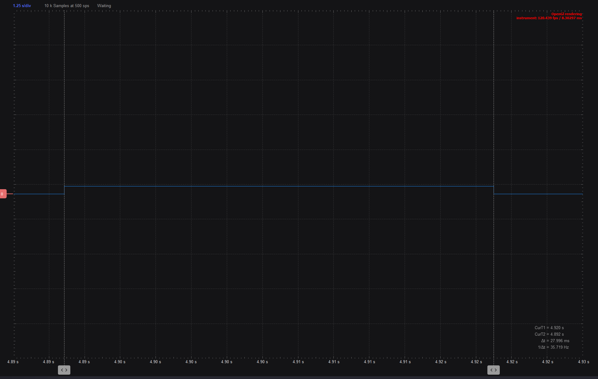
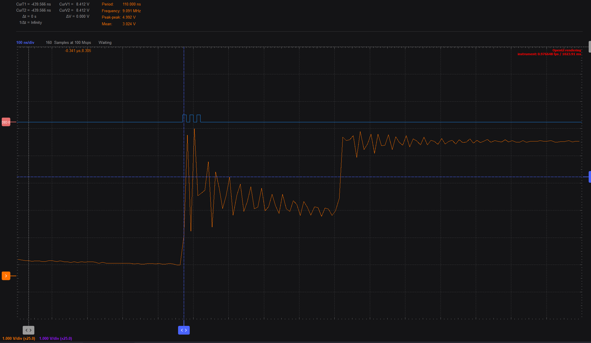

# Project 6: LED turns ON for 5 seconds on button press - the use of timers in Arduino

1. Understand the use of timers in Arduino and problems that they can solve

## Write a program that does the following:
- Turn on an LED on pin 4 when a button is pressed using interrupts
- The LED should turn off after 5 seconds
- Do not use a delay() function here. Please use the system clock to measure the time. look for the millis() function in the Arduino reference.
Test the code and make sure it works as expected
paste a screen shot from the logic analyzer below:
 
## update the code to add a delay in the loop function
- Add the same for loop as in the previous exercise to simulate a long process. Does the LED still turn off after 5 seconds? Why or why not?
answer here: the led doesn't turn on because the loop is too busy and doesn't process it properly.
add a screen shot from the logic analyzer below:

## Write a second program. The proper way to solve this problem is to use a timer
- Install the MsTimer2 package from the Library Manager.
- Read the package README and note its limitations: it uses Timer2 and is best for short periodic tasks.
- Open an example from the package, examine the callback-based pattern, and see how the timer is started and stopped.
- Implement a timer that turns off the LED after 5 seconds.
- The callback runs when the configured timer interval expires. In this implementation, it is called once after 5000 ms and turns the LED off.

## Exercises
 - Comparison of AI changes if any:
- check that although the delay of 1 second is still in the loop function, the LED now turns off after 5 seconds

- change the LED time ON from 5 seconds to 30 ms, measure in the scope the time the LED is ON. is it 30 ms? Why or why not?
answer here: it's not 30ms! we don't know why
paste a screen shot from the scope below:

